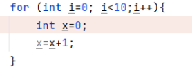
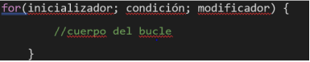
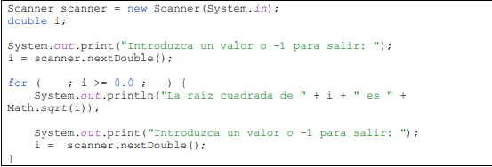
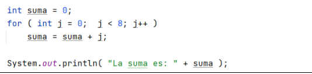
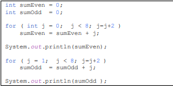
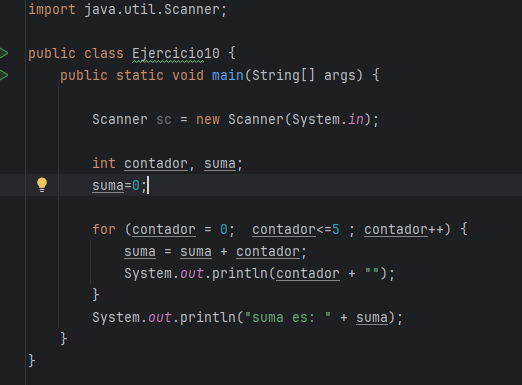

3. a) En el bucle, las comas (,) deben ser puntos y comas (;).
b) EL decremento debe ser k-- en lugar de k−−;. El símbolo de la resta utilizado no es el correcto.
 

4. a. Es infinito porque k no cambia. Solución: incrementar k. 
b. No se ejecuta porque la condición nunca es verdadera. Solución: cambiar a k <= 100.  
c. No tiene problemas.  
d. Es infinito porque k disminuye indefinidamente. Solución: incrementar k.  
e. No es infinito, funciona bien.  
f. Funciona bien, no es infinito.  
g. Es infinito porque k se vuelve 0. Solución: incrementar k.

5. 

El código reinicia `x` cada vez. Debes poner `x` fuera del `for` para que sume correctamente.

6. 

a.Sí, se puede omitir. El bucle seguirá ejecutándose, pero debería asegurar de modificar la variable de control (normalmente en el cuerpo del bucle), o podría crear un bucle infinito.
b.Sí, también se pueden omitir ambas. Si omites la condición, el bucle se convertirá en un bucle infinito, a menos que agregues un break dentro del cuerpo para terminarlo.

7.

a. Partes no incluidas en el bucle for:
Inicialización: No hay, debería hacerse antes del bucle.
Incremento: No hay, se actualiza i dentro del bucle.

b. Si eliminas la condición (for( ; ; )):
Se crea un bucle infinito, ya que no hay condición para detenerlo, y el programa seguirá pidiendo valores indefinidamente

8. 

Error de tipografía: Cambia Sytem.out.println a System.out.println.

a. Error de alcance: Si añades System.out.println("El valor de j es: " + j); después de imprimir la suma, obtendrás un error de compilación porque j no es accesible fuera del bucle for.

Solución: Declara j antes del bucle:

9. 

1. Error: No puedo usar la variable `j` en ambos bucles porque solo se declara en el primero.

2. Corrección: Debo declarar `j` en cada bucle por separado y agregar llaves para mayor claridad.

3. Resultado: Así, el programa calculará correctamente la suma de los números pares e impares.

10.

Asi como queda el ejemplo con el bucle for, y las ventejas de for a diferencia de while son:

- El `for` es más claro cuando sabes cuántas veces va a iterar, porque todo está en una sola línea. Así evitas errores y el código se entiende mejor.